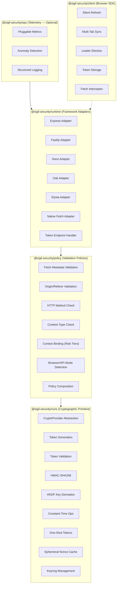
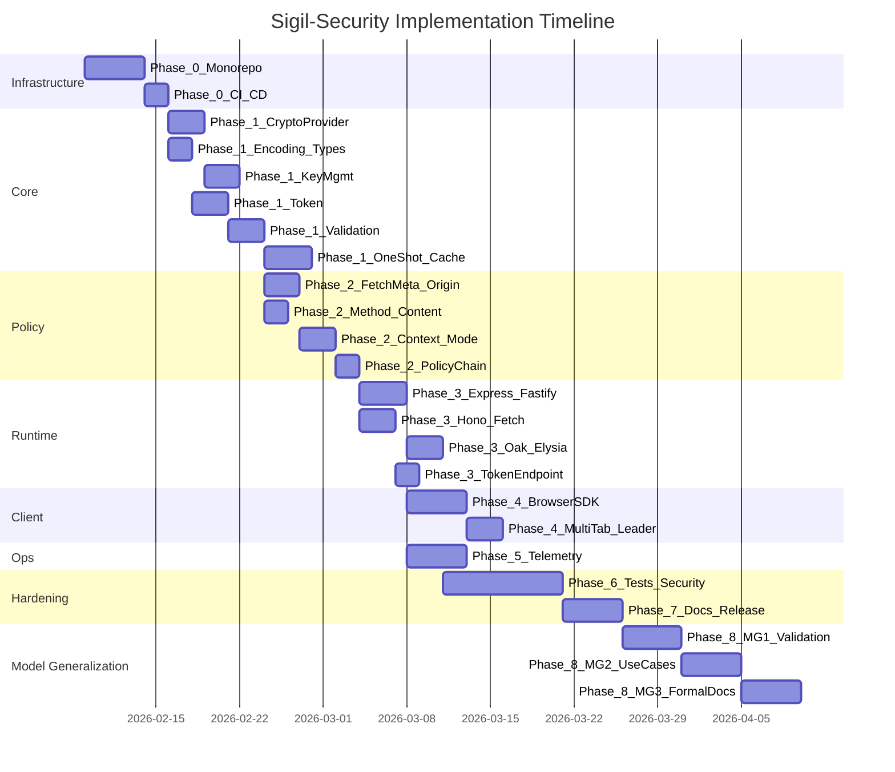

# Sigil-Security: Implementation Plan

**Version:** 1.1 (merged)
**Status:** Active
**Timeline:** 10-14 weeks (core) + 2-3 weeks (model generalization)
**Created:** 2026-02-08

---

**Table of Contents:**

- [Project Status](#project-status)
- [Architecture Overview](#architecture-overview)
- [Technology Decisions](#technology-decisions)
- [Phase 0: Monorepo Infrastructure](#phase-0-monorepo-infrastructure)
- [Phase 1: @sigil-security/core](#phase-1-sigil-securitycore)
- [Phase 2: @sigil-security/policy](#phase-2-sigil-securitypolicy)
- [Phase 3: @sigil-security/runtime](#phase-3-sigil-securityruntime)
- [Phase 4: @sigil-security/client](#phase-4-sigil-securityclient)
- [Phase 5: @sigil-security/ops](#phase-5-sigil-securityops)
- [Phase 6: Testing & Security Hardening](#phase-6-testing--security-hardening)
- [Phase 7: Documentation & Release](#phase-7-documentation--release)
- [Phase 8: Model Generalization](#phase-8-model-generalization)
- [Dependency Graph & Timeline](#dependency-graph--timeline)
- [Risk Register](#risk-register)
- [Definition of Done](#definition-of-done)

---

## Project Status

The repository is currently **specification-only**. Contents:

- `README.md` — Project overview
- `docs/BOUNDARY_SPECIFICATION.md` — Core boundary rules (244 lines, normative)
- `docs/SPECIFICATION.md` — Technical specification (1724 lines)
- `docs/OPERATIONS.md` — Operations manual (921 lines)
- `docs/MODEL_GENERALIZATION.md` — Model generalization (233 lines)
- `docs/CRYPTO_ANALYSIS.md` — Cryptographic backend analysis (226 lines)
- `.cursor/rules/` — Architecture, security, and code quality rules
- `.gitignore`, `.node-version` (18), `LICENSE` (Apache 2.0), `CONTRIBUTING.md`, `SECURITY.md`

**No implementation code, package.json, tsconfig, test files, or CI/CD configuration exists.**

---

## Architecture Overview



**Dependency Direction (one-way only, strictly enforced):**

```
client → runtime → policy → core
                    ops → runtime
```

**Governing Principle:** Every implementation decision is validated against:
1. `BOUNDARY_SPECIFICATION.md` — What the core MUST and MUST NOT do
2. `SPECIFICATION.md` — Token model, validation layers, lifecycle
3. `CRYPTO_ANALYSIS.md` — Cryptographic stack decisions

---

## Technology Decisions

| Decision | Choice | Rationale |
|----------|--------|-----------|
| Language | TypeScript (strict mode) | Type safety for crypto code, auditability |
| Monorepo | pnpm workspaces | Fast, strict, native workspace support |
| Packages | 5 (`core`, `policy`, `runtime`, `ops`, `client`) | Layer separation per BOUNDARY_SPECIFICATION |
| Crypto | WebCrypto API only | Zero dependencies, cross-runtime, constant-time |
| Build | tsup (ESM + CJS dual output) | Fast, simple, dual-format |
| Test | vitest (unit + integration + benchmark) | Fast, native TS, bench support |
| Lint | ESLint (flat config) + Prettier | Modern config, no legacy |
| CI | GitHub Actions | Standard, matrix support |

---

## Phase 0: Monorepo Infrastructure

**Duration:** ~1 week
**Goal:** Production-ready monorepo skeleton with CI/CD, tooling, and package scaffolding.
**Dependencies:** None (starting point)

### 0.1 Workspace Configuration

| Task | File(s) | Details |
|------|---------|---------|
| Root package.json | `package.json` | `"private": true`, pnpm workspace scripts (`build`, `test`, `lint`, `format`, `typecheck`) |
| pnpm workspace | `pnpm-workspace.yaml` | `packages: ["packages/*"]` |
| Node version | `.node-version` | `18` (already exists) |
| Package manager | `.npmrc` | `shamefully-hoist=false`, `strict-peer-dependencies=true` |

### 0.2 TypeScript Configuration

| Task | File(s) | Details |
|------|---------|---------|
| Root tsconfig | `tsconfig.base.json` | `strict: true`, `target: "ES2022"`, `module: "ESNext"`, `moduleResolution: "bundler"`, path aliases |
| Per-package tsconfig | `packages/*/tsconfig.json` | Extends root, package-specific `include`/`outDir`, project references |

**TypeScript Strict Settings (non-negotiable):**

```json
{
  "strict": true,
  "noUncheckedIndexedAccess": true,
  "exactOptionalPropertyTypes": true,
  "noImplicitReturns": true,
  "noFallthroughCasesInSwitch": true,
  "forceConsistentCasingInFileNames": true,
  "isolatedModules": true
}
```

### 0.3 Build System

| Task | File(s) | Details |
|------|---------|---------|
| tsup configuration | `packages/*/tsup.config.ts` | ESM + CJS dual output, `.d.ts` generation, `target: "node18"` |
| Package exports | `packages/*/package.json` | `"exports"` field with `import`/`require`/`types` conditions |

### 0.4 Code Quality

| Task | File(s) | Details |
|------|---------|---------|
| ESLint config | `eslint.config.js` | Flat config, TypeScript rules, no-any enforcement, security-specific rules |
| Prettier config | `.prettierrc` | `semi: false`, `singleQuote: true`, `trailingComma: "all"`, `printWidth: 100` |
| EditorConfig | `.editorconfig` | Consistent formatting across editors |

### 0.5 Testing Framework

| Task | File(s) | Details |
|------|---------|---------|
| Vitest root config | `vitest.config.ts` | Workspace mode, coverage thresholds (>90% lines, >85% branches) |
| Per-package vitest | `packages/*/vitest.config.ts` | Package-specific setup, benchmark support |

### 0.6 CI/CD

| Task | File(s) | Details |
|------|---------|---------|
| GitHub Actions CI | `.github/workflows/ci.yml` | Matrix: Node 18/20/22, pnpm install, typecheck, lint, test, build |
| Cross-runtime CI | `.github/workflows/cross-runtime.yml` | Node, Bun, Deno matrix for core package |
| Release workflow | `.github/workflows/release.yml` | Changesets-based version bump and npm publish |

### 0.7 Package Scaffolding

```
packages/
  core/                  → @sigil-security/core
    src/
      index.ts
      crypto-provider.ts
      web-crypto-provider.ts
      key-derivation.ts
      key-manager.ts
      token.ts
      validation.ts
      context.ts
      one-shot-token.ts
      nonce-cache.ts
      encoding.ts
      types.ts
    __tests__/
    package.json
    tsconfig.json
    tsup.config.ts

  policy/                → @sigil-security/policy
    src/
      index.ts
      fetch-metadata.ts
      origin.ts
      method.ts
      content-type.ts
      context-binding.ts
      mode-detection.ts
      policy-chain.ts
      token-transport.ts
      types.ts
    __tests__/
    package.json
    tsconfig.json
    tsup.config.ts

  runtime/               → @sigil-security/runtime
    src/
      index.ts
      sigil.ts
      extract-metadata.ts
      token-endpoint.ts
      error-response.ts
      types.ts
      adapters/
        express.ts
        fastify.ts
        hono.ts
        oak.ts
        elysia.ts
        fetch.ts
    __tests__/
    package.json
    tsconfig.json
    tsup.config.ts

  ops/                   → @sigil-security/ops
    src/
      index.ts
      metrics.ts
      metric-points.ts
      telemetry-middleware.ts
      anomaly.ts
      structured-logger.ts
      types.ts
    __tests__/
    package.json
    tsconfig.json
    tsup.config.ts

  client/                → @sigil-security/client
    src/
      index.ts
      token-store.ts
      refresh.ts
      sync.ts
      leader.ts
      interceptor.ts
      one-shot.ts
      types.ts
    __tests__/
    package.json
    tsconfig.json
    tsup.config.ts
```

### Phase 0 Checklist

- [ ] Root `package.json` with workspace scripts
- [ ] `pnpm-workspace.yaml`
- [ ] `tsconfig.base.json` with strict settings
- [ ] ESLint flat config
- [ ] Prettier config
- [ ] `.editorconfig`
- [ ] Vitest workspace config
- [ ] GitHub Actions CI (Node 18/20/22 matrix)
- [ ] Cross-runtime CI workflow (Node, Bun, Deno)
- [ ] Release workflow (changesets)
- [ ] Package scaffolding (all 5 packages with empty `src/index.ts`)
- [ ] `pnpm install` succeeds
- [ ] `pnpm build` succeeds (empty packages)
- [ ] `pnpm test` succeeds (no tests yet)
- [ ] `pnpm lint` passes
- [ ] `pnpm typecheck` passes

---

## Phase 1: @sigil-security/core

**Duration:** 2-3 weeks
**Goal:** Complete cryptographic primitive — zero dependencies, pure, deterministic, constant-time.
**Dependencies:** Phase 0 complete
**Reference:** `BOUNDARY_SPECIFICATION.md`, `SPECIFICATION.md` Part I, `CRYPTO_ANALYSIS.md`

This is the **most critical phase**. Every function in core must satisfy:
- Deterministic (same input → same output)
- Side-effect free (except ephemeral nonce cache)
- I/O free (no network, filesystem, database)
- Runtime agnostic (Node 18+, Bun, Deno, Edge)
- Framework agnostic (no HTTP objects)

### 1.1 Encoding Utilities

**File:** `src/encoding.ts`

| Function | Signature | Spec Reference |
|----------|-----------|----------------|
| `toBase64Url` | `(buffer: Uint8Array) => string` | RFC 4648, no padding |
| `fromBase64Url` | `(encoded: string) => Uint8Array` | RFC 4648, no padding |
| `writeUint64BE` | `(buffer: Uint8Array, value: number, offset: number) => void` | Token ts field (big-endian int64) |
| `readUint64BE` | `(buffer: Uint8Array, offset: number) => number` | Token ts field parsing |
| `concatBuffers` | `(...buffers: Uint8Array[]) => Uint8Array` | Token assembly |

**Constraints:**
- No external dependencies
- Pure functions only
- Used by both regular and one-shot token modules

### 1.2 CryptoProvider Abstraction

**Files:** `src/crypto-provider.ts`, `src/web-crypto-provider.ts`

All crypto operations go through the `CryptoProvider` interface — never call `crypto.subtle` directly from token/validation code:

```typescript
// Interface (crypto-provider.ts)
interface CryptoProvider {
  sign(key: CryptoKey, data: Uint8Array): Promise<ArrayBuffer>
  verify(key: CryptoKey, signature: ArrayBuffer, data: Uint8Array): Promise<boolean>
  deriveKey(master: ArrayBuffer, salt: string, info: string): Promise<CryptoKey>
  randomBytes(length: number): Uint8Array
  hash(data: Uint8Array): Promise<ArrayBuffer>
}
```

```typescript
// Default implementation (web-crypto-provider.ts)
class WebCryptoCryptoProvider implements CryptoProvider {
  // Uses crypto.subtle exclusively
  // HMAC-SHA256 for sign/verify
  // HKDF-SHA256 for deriveKey
  // crypto.getRandomValues for randomBytes
  // SHA-256 for hash
}
```

**Constraints:**
- `WebCryptoCryptoProvider` is the ONLY shipped implementation
- Extension point for KMS/HSM documented but not built until needed
- Core functions depend on `CryptoProvider`, not concrete `crypto.subtle`

### 1.3 Key Management

**Files:** `src/key-derivation.ts`, `src/key-manager.ts`

#### Key Derivation with Domain Separation (`key-derivation.ts`)

HKDF-based **domain-separated** key derivation. Different token types derive keys from different paths — closes the cross-protocol attack surface:

```
master
 ├─ csrf      → HKDF(master, salt="sigil-v1", info="csrf-signing-key-"+kid)
 ├─ oneshot   → HKDF(master, salt="sigil-v1", info="oneshot-signing-key-"+kid)
 └─ internal  → HKDF(master, salt="sigil-v1", info="internal-signing-key-"+kid)
```

| Function | Details |
|----------|---------|
| `deriveSigningKey(crypto, master, kid, domain)` | HKDF-SHA256 with domain-separated info parameter |

#### Keyring (`key-manager.ts`)

| Type | Details |
|------|---------|
| `Keyring` | Max 3 keys (active + 2 previous), **per domain** |
| `KeyManager` | Create keyring, rotate, resolve by kid |

**Operations:**
- `createKeyring(crypto, masterSecret, initialKid, domain)` → generates initial keyring
- `rotateKey(keyring, crypto, masterSecret, domain)` → new key becomes active, oldest dropped
- `resolveKey(keyring, kid)` → find key by kid, returns undefined if not found
- Token generation: ALWAYS use active key
- Token validation: try ALL keys in keyring (match by kid from token)

### 1.4 Token Model & Types

**File:** `src/types.ts`

```typescript
// Branded types
type TokenString = string & { readonly __brand: 'SigilToken' }
type OneShotTokenString = string & { readonly __brand: 'SigilOneShotToken' }

// Token structure constants
const KID_SIZE = 1        // 1 byte (8-bit key ID)
const NONCE_SIZE = 16     // 16 bytes (128-bit)
const TIMESTAMP_SIZE = 8  // 8 bytes (int64 big-endian)
const CONTEXT_SIZE = 32   // 32 bytes (SHA-256 hash, ALWAYS present)
const MAC_SIZE = 32       // 32 bytes (HMAC-SHA256, full, NO truncation)

const TOKEN_RAW_SIZE = 89   // kid(1) + nonce(16) + ts(8) + ctx(32) + mac(32)
const ONESHOT_RAW_SIZE = 120 // nonce(16) + ts(8) + action(32) + ctx(32) + mac(32)

// Parsed token
interface ParsedToken {
  readonly kid: number
  readonly nonce: Uint8Array
  readonly timestamp: number
  readonly context: Uint8Array
  readonly mac: Uint8Array
}

// Parsed one-shot token
interface ParsedOneShotToken {
  readonly nonce: Uint8Array
  readonly timestamp: number
  readonly action: Uint8Array
  readonly context: Uint8Array
  readonly mac: Uint8Array
}

// Result types (never throw for validation)
type ValidationResult =
  | { readonly valid: true }
  | { readonly valid: false; readonly reason: string }

type GenerationResult =
  | { readonly success: true; readonly token: TokenString; readonly expiresAt: number }
  | { readonly success: false; readonly reason: string }
```

**Constant-Length Token (length oracle protection):**

Token length is **fixed**. Even when `ctx` is not used, a 32-byte zero-padded hash is written. This completely closes the length oracle:

```
Regular:  kid[1] + nonce[16] + ts[8] + ctx[32] + mac[32] = 89 bytes (FIXED)
One-shot: nonce[16] + ts[8] + action[32] + ctx[32] + mac[32] = 120 bytes (FIXED)
```

### 1.5 Token Generation

**File:** `src/token.ts`

| Function | Signature |
|----------|-----------|
| `generateToken` | `(crypto, key, kid, context?, now?) => Promise<GenerationResult>` |
| `parseToken` | `(tokenString) => ParsedToken \| null` |
| `serializeToken` | `(kid, nonce, ts, ctx, mac) => TokenString` |

**Token Wire Format (89 bytes raw → base64url encoded):**

```
[ kid:1 ][ nonce:16 ][ ts:8 ][ ctx:32 ][ mac:32 ]
```

**Generation Steps:**
1. Generate nonce: `crypto.randomBytes(16)`
2. Get current timestamp: `now` parameter (default `Date.now()`)
3. Compute context: `ctx` provided or `SHA-256(0x00)` (zero-pad, ALWAYS 32 bytes)
4. Assemble payload: `kid | nonce | ts | ctx`
5. Sign: `HMAC-SHA256(derived_key, payload)`
6. Encode: `base64url(kid | nonce | ts | ctx | mac)`

**Parse Steps (fixed offsets, no length oracle):**
1. Decode base64url
2. Verify raw length === 89 bytes (constant-time length check)
3. Extract fields at fixed offsets: kid@0, nonce@1, ts@17, ctx@25, mac@57

### 1.6 Token Validation

**File:** `src/validation.ts`

| Function | Signature |
|----------|-----------|
| `validateToken` | `(crypto, keyring, tokenString, expectedContext?, ttlMs?, graceWindowMs?, now?) => Promise<ValidationResult>` |
| `validateTTL` | `(tokenTimestamp, ttlMs, graceWindowMs, now) => { withinTTL, inGraceWindow }` |

**Deterministic Failure Model (CRITICAL — spec Section 5.8):**

All validation steps MUST complete. No early return. Single exit point. Timing is deterministic regardless of which step fails.

```typescript
async function validateToken(...): Promise<ValidationResult> {
  let valid = true
  let reason = 'unknown'

  // Step 1: Parse (constant-time length check)
  const parsed = parseToken(tokenString)
  const parseOk = parsed !== null
  valid &&= parseOk

  // Step 2: Resolve key (try all keys in keyring by kid)
  const key = parseOk ? resolveKey(keyring, parsed.kid) : null
  const keyOk = key !== null
  valid &&= keyOk

  // Step 3: TTL check
  const ttlResult = parseOk
    ? validateTTL(parsed.timestamp, ttlMs, graceWindowMs, now)
    : { withinTTL: false, inGraceWindow: false }
  valid &&= ttlResult.withinTTL || ttlResult.inGraceWindow
  if (!ttlResult.withinTTL && !ttlResult.inGraceWindow) reason = 'expired'

  // Step 4: HMAC verify (constant-time via crypto.subtle.verify)
  // MUST run even if earlier steps failed (deterministic timing)
  const macPayload = parseOk ? assemblePayload(parsed) : DUMMY_PAYLOAD
  const macOk = keyOk
    ? await crypto.verify(key.cryptoKey, parsed.mac, macPayload)
    : false
  valid &&= macOk
  if (!macOk) reason = 'invalid_mac'

  // Step 5: Context check
  const contextOk = parseOk && expectedContext
    ? constantTimeEqual(parsed.context, expectedContext)
    : true // context binding optional
  valid &&= contextOk
  if (!contextOk) reason = 'context_mismatch'

  // Single exit point — constant time
  return valid
    ? { valid: true }
    : { valid: false, reason }
}
```

**Constraints:**
- `reason` captures the LAST failure (internal logging only)
- Client receives ONLY `{ valid: false, reason: "CSRF validation failed" }` (uniform error)

### 1.7 Context Binding

**File:** `src/context.ts`

| Function | Signature |
|----------|-----------|
| `computeContext` | `(crypto, ...bindings: string[]) => Promise<Uint8Array>` |
| `emptyContext` | `(crypto) => Promise<Uint8Array>` |

**Logic:**
- If bindings provided: `SHA-256(binding1 + binding2 + ...)` → 32 bytes
- If no bindings: `SHA-256(0x00)` → 32 bytes (zero-pad, NEVER empty)
- Context is ALWAYS 32 bytes — eliminates length oracle

### 1.8 One-Shot Token

**File:** `src/one-shot-token.ts`

**Wire Format (120 bytes raw → base64url encoded):**

```
[ nonce:16 ][ ts:8 ][ action:32 ][ ctx:32 ][ mac:32 ]
```

| Function | Signature |
|----------|-----------|
| `generateOneShotToken` | `(crypto, key, action, context?, now?) => Promise<OneShotGenerationResult>` |
| `parseOneShotToken` | `(tokenString) => ParsedOneShotToken \| null` |
| `validateOneShotToken` | `(crypto, key, tokenString, expectedAction, nonceCache, expectedContext?, ttlMs?, now?) => Promise<ValidationResult>` |

**Action Binding:**
- `action = SHA-256("POST:/api/account/delete")` → 32 bytes
- Token is bound to a specific action — cross-action replay impossible

**Domain Separation:** One-shot tokens use a DIFFERENT HKDF derivation path (`oneshot-signing-key-{kid}`) than regular tokens. A regular token key CANNOT validate a one-shot token.

### 1.9 Nonce Cache

**File:** `src/nonce-cache.ts`

```typescript
interface NonceCache {
  has(nonce: Uint8Array): boolean
  markUsed(nonce: Uint8Array): boolean  // atomic CAS: returns true if successfully marked
  add(nonce: Uint8Array, ttlMs: number): void
  readonly size: number
}
```

**Implementation:** In-memory LRU + TTL (custom implementation — no external dependency)

| Parameter | Value | Rationale |
|-----------|-------|-----------|
| Max entries | 10,000 | Memory-bounded (~1MB at 10k * ~100 bytes) |
| TTL | 5 minutes | Matches one-shot token TTL |
| Eviction | LRU | Oldest entries first when capacity reached |

**Constraints:**
- `markUsed` is atomic compare-and-swap (prevent race conditions)
- Cache is an optimization, NOT a security guarantee
- Must fail-open if cache is unavailable
- NO external storage (Redis, DB) — in-memory only
- Non-distributed, non-persistent

### 1.10 Public API Surface

**File:** `src/index.ts`

Exports only what higher layers need:

```typescript
// Types
export type { CryptoProvider, TokenString, OneShotTokenString, ValidationResult, ... }
export type { ParsedToken, ParsedOneShotToken, TokenConfig, KeyringConfig, ... }

// CryptoProvider
export { WebCryptoCryptoProvider } from './web-crypto-provider'

// Key Management
export { createKeyring, rotateKey } from './key-manager'

// Token Operations
export { generateToken, parseToken, validateToken } from './token'
export { computeContext, emptyContext } from './context'

// One-Shot Operations
export { generateOneShotToken, validateOneShotToken } from './one-shot-token'

// Nonce Cache
export { createNonceCache } from './nonce-cache'
export type { NonceCache } from './nonce-cache'

// Constants
export { TOKEN_RAW_SIZE, ONESHOT_RAW_SIZE, NONCE_SIZE, ... } from './types'
```

### Phase 1 Checklist

- [ ] `src/encoding.ts` — base64url, buffer ops
- [ ] `src/types.ts` — branded types, constants, result types
- [ ] `src/crypto-provider.ts` — CryptoProvider interface
- [ ] `src/web-crypto-provider.ts` — WebCrypto implementation
- [ ] `src/key-derivation.ts` — HKDF with domain separation
- [ ] `src/key-manager.ts` — Keyring (max 3 keys), rotation
- [ ] `src/context.ts` — Context binding (always 32 bytes)
- [ ] `src/token.ts` — Token generation, parsing, serialization (89 bytes fixed)
- [ ] `src/validation.ts` — Deterministic failure model, constant-time validation
- [ ] `src/one-shot-token.ts` — One-shot generation, parsing, validation (120 bytes fixed)
- [ ] `src/nonce-cache.ts` — LRU + TTL cache (10k max, 5min TTL, atomic CAS)
- [ ] `src/index.ts` — Public API surface
- [ ] `__tests__/encoding.test.ts`
- [ ] `__tests__/crypto-provider.test.ts`
- [ ] `__tests__/key-manager.test.ts`
- [ ] `__tests__/token.test.ts`
- [ ] `__tests__/validation.test.ts`
- [ ] `__tests__/one-shot-token.test.ts`
- [ ] `__tests__/nonce-cache.test.ts`
- [ ] Zero runtime dependencies verified
- [ ] All exports have explicit return types
- [ ] No `any` on exported APIs
- [ ] Token size assertions (89 / 120 bytes)
- [ ] Constant-time validation verified (no early returns)
- [ ] Cross-runtime test (Node 18+)

**Performance Target:** Token validation < 50µs

---

## Phase 2: @sigil-security/policy

**Duration:** 1-2 weeks
**Goal:** Validation policies that interpret HTTP signals — depends only on `@sigil-security/core`.
**Dependencies:** Phase 1 complete
**Reference:** `SPECIFICATION.md` Sections 5, 6, 8

### 2.1 Policy Interface

**File:** `src/types.ts`

```typescript
// Input: normalized request metadata (NOT raw HTTP objects)
interface RequestMetadata {
  readonly method: string
  readonly origin: string | null
  readonly referer: string | null
  readonly secFetchSite: string | null
  readonly secFetchMode: string | null
  readonly secFetchDest: string | null
  readonly contentType: string | null
  readonly tokenSource: TokenSource
}

type TokenSource =
  | { readonly from: 'header'; readonly value: string }
  | { readonly from: 'body-json'; readonly value: string }
  | { readonly from: 'body-form'; readonly value: string }
  | { readonly from: 'none' }

// Policy result
type PolicyResult =
  | { readonly allowed: true }
  | { readonly allowed: false; readonly reason: string }

// Policy validator interface
interface PolicyValidator {
  validate(metadata: RequestMetadata): PolicyResult
}
```

**CRITICAL:** The policy layer accepts `RequestMetadata` (a plain object), NOT `Request`, `req`, `res`, or any framework-specific type. The runtime layer is responsible for extracting `RequestMetadata` from framework objects.

### 2.2 Fetch Metadata Policy

**File:** `src/fetch-metadata.ts`

| Function | Details |
|----------|---------|
| `createFetchMetadataPolicy(config)` | Returns a `PolicyValidator` |

**Logic (from SPECIFICATION.md Section 5.1):**
- `Sec-Fetch-Site: same-origin` → allow
- `Sec-Fetch-Site: same-site` → allow (log cross-origin if Origin differs)
- `Sec-Fetch-Site: cross-site` → reject (state-changing request)
- `Sec-Fetch-Site: none` → reject (browser extension, untrusted)
- Header absent → depends on mode:
  - `legacyBrowserMode: 'degraded'` → fallback to Origin + Token (log warning)
  - `legacyBrowserMode: 'strict'` → reject

**Edge Cases:**
- Service Worker requests: fallback to Origin/Referer
- Browser extension requests: reject (`Sec-Fetch-Site: none`)
- Same-site but cross-origin (subdomain): allow but log

### 2.3 Origin / Referer Policy

**File:** `src/origin.ts`

| Function | Details |
|----------|---------|
| `createOriginPolicy(config)` | Returns a `PolicyValidator` |

**Logic (from SPECIFICATION.md Section 5.2):**
- Origin header present → strict match against allowed origins (trusted origins list)
- Origin absent → Referer header fallback (extract origin from Referer URL)
- Both absent → reject (no provenance signal)

### 2.4 Method Policy

**File:** `src/method.ts`

| Function | Details |
|----------|---------|
| `createMethodPolicy(config?)` | Returns a `PolicyValidator` |

**Default Protected Methods:** `POST`, `PUT`, `PATCH`, `DELETE`
**Unprotected:** `GET`, `HEAD`, `OPTIONS`

### 2.5 Content-Type Policy

**File:** `src/content-type.ts`

| Function | Details |
|----------|---------|
| `createContentTypePolicy(config?)` | Returns a `PolicyValidator` |

**Allowed:** `application/json`, `application/x-www-form-urlencoded`, `multipart/form-data`

### 2.6 Browser vs API Mode Detection

**File:** `src/mode-detection.ts`

| Function | Details |
|----------|---------|
| `detectClientMode(metadata)` | Returns `'browser' \| 'api'` |

**Logic (from SPECIFICATION.md Section 8.2):**
- `Sec-Fetch-Site` present → Browser Mode (full multi-layer: Fetch Metadata + Origin + Token)
- `Sec-Fetch-Site` absent → API Mode (token-only, context binding recommended)
- Manual override: `X-Client-Type: api` → Force API Mode

### 2.7 Context Binding Policy (Risk Tiers)

**File:** `src/context-binding.ts`

| Tier | Binding | Failure Mode | Use Case |
|------|---------|-------------|----------|
| Low Assurance | Optional / soft-fail | Log only | Read endpoints |
| Medium Assurance | Session ID hash, soft-fail | Log + allow (5min grace) | Settings change |
| High Assurance | Session + User + Origin, fail-closed | Reject + audit | Money transfer |

### 2.8 Policy Composition

**File:** `src/policy-chain.ts`

```typescript
function createPolicyChain(policies: PolicyValidator[]): PolicyValidator {
  // Runs ALL policies (no short-circuit)
  // Returns first failure reason (for internal logging)
  // All policies execute regardless of individual results
}
```

### 2.9 Token Transport Precedence

**File:** `src/token-transport.ts`

**Precedence (from SPECIFICATION.md Section 8.3):**
1. Custom Header: `X-CSRF-Token`
2. Request Body (JSON): `{ "csrf_token": "..." }`
3. Request Body (form): `csrf_token=...`
4. Query Parameter: NEVER (deprecated, insecure — reject with warning)

Multiple tokens present → first match wins, log warning.

### Phase 2 Checklist

- [ ] `src/types.ts` — `RequestMetadata`, `PolicyResult`, `PolicyValidator`, `TokenSource`
- [ ] `src/fetch-metadata.ts` — Fetch Metadata policy (degraded + strict modes)
- [ ] `src/origin.ts` — Origin/Referer policy
- [ ] `src/method.ts` — HTTP method filtering
- [ ] `src/content-type.ts` — Content-Type restriction
- [ ] `src/mode-detection.ts` — Browser vs API mode
- [ ] `src/context-binding.ts` — Risk tier model (low/medium/high)
- [ ] `src/policy-chain.ts` — Policy composition (no short-circuit)
- [ ] `src/token-transport.ts` — Token extraction precedence
- [ ] `src/index.ts` — Public API
- [ ] Tests for each policy (allow/reject scenarios)
- [ ] Edge case tests (missing headers, service workers, extensions, subdomains)
- [ ] No HTTP objects in policy layer (only `RequestMetadata`)
- [ ] Depends only on `@sigil-security/core`

---

## Phase 3: @sigil-security/runtime

**Duration:** 2-3 weeks
**Goal:** Framework adapters that bridge HTTP objects to the policy layer.
**Dependencies:** Phase 1 + Phase 2 complete
**Reference:** `SPECIFICATION.md` Sections 3, 8

### 3.1 Common Middleware Interface

**File:** `src/types.ts`

```typescript
interface SigilConfig {
  // Core
  readonly masterSecret: ArrayBuffer | string
  readonly tokenTTL?: number           // default: 20 * 60 * 1000 (20min)
  readonly graceWindow?: number        // default: 60 * 1000 (60s)

  // Policy
  readonly allowedOrigins: readonly string[]
  readonly legacyBrowserMode?: 'degraded' | 'strict'  // default: 'degraded'
  readonly allowApiMode?: boolean      // default: true
  readonly protectedMethods?: readonly string[]  // default: ['POST','PUT','PATCH','DELETE']

  // Context binding
  readonly contextBinding?: ContextBindingConfig

  // One-shot
  readonly oneShotEnabled?: boolean
  readonly oneShotTTL?: number         // default: 5 * 60 * 1000 (5min)

  // Token transport
  readonly headerName?: string         // default: 'x-csrf-token'
  readonly oneShotHeaderName?: string  // default: 'x-csrf-one-shot-token'

  // CryptoProvider override
  readonly cryptoProvider?: CryptoProvider
}
```

### 3.2 Request Metadata Extractor

**File:** `src/extract-metadata.ts`

Each adapter implements a framework-specific extractor that produces `RequestMetadata`:

```typescript
type MetadataExtractor<TRequest> = (req: TRequest) => RequestMetadata
```

### 3.3 Framework Adapters

Each adapter follows the same pattern:
1. Extract `RequestMetadata` from framework-specific request object
2. Pass to policy chain
3. If token validation needed, pass to core
4. Return framework-specific response

| Adapter | File | Framework Type |
|---------|------|---------------|
| Express | `src/adapters/express.ts` | `RequestHandler` middleware (`req/res/next`) |
| Fastify | `src/adapters/fastify.ts` | `FastifyPluginCallback` (hook/plugin + schema) |
| Hono | `src/adapters/hono.ts` | `MiddlewareHandler` (`c.req`/`c.res`) |
| Oak | `src/adapters/oak.ts` | Oak middleware (Deno) |
| Elysia | `src/adapters/elysia.ts` | Elysia plugin (Bun) |
| Native Fetch | `src/adapters/fetch.ts` | `Request/Response` API (Edge runtime) |

**Framework packages are PEER dependencies** — not bundled.

### 3.4 Token Endpoint Handler

**File:** `src/token-endpoint.ts`

```typescript
// GET /api/csrf/token → Generate regular token
// POST /api/csrf/one-shot → Generate one-shot token (with action binding)
```

Returns: `{ token, expiresAt }` (regular) or `{ token, expiresAt, action }` (one-shot)

### 3.5 Error Response

**File:** `src/error-response.ts`

- Validation failure → `403 { error: "CSRF validation failed" }` (NEVER differentiate)
- Token expired → `403 { error: "CSRF validation failed" }` + `X-CSRF-Token-Expired: true` header
- Reason details → internal logs ONLY

### Phase 3 Checklist

- [ ] `src/types.ts` — `SigilConfig`, adapter types
- [ ] `src/extract-metadata.ts` — Metadata extraction contract
- [ ] `src/sigil.ts` — Core Sigil instance (keyring, config, validation orchestration)
- [ ] `src/token-endpoint.ts` — Token generation/refresh endpoint handler
- [ ] `src/error-response.ts` — Uniform error responses
- [ ] `src/adapters/express.ts`
- [ ] `src/adapters/fastify.ts`
- [ ] `src/adapters/hono.ts`
- [ ] `src/adapters/oak.ts`
- [ ] `src/adapters/elysia.ts`
- [ ] `src/adapters/fetch.ts`
- [ ] Integration tests (per adapter, with mock server)
- [ ] Token generation endpoint tests
- [ ] Error response uniformity tests
- [ ] Framework packages as peer dependencies

---

## Phase 4: @sigil-security/client

**Duration:** 1-2 weeks
**Goal:** Browser SDK for token lifecycle management.
**Dependencies:** Phase 3 complete (needs endpoint contract)
**Reference:** `SPECIFICATION.md` Part II (Token Lifecycle)

### 4.1 Token Storage

**File:** `src/token-store.ts`

- `localStorage` for multi-tab persistence
- Keys: `sigil_csrf_token`, `sigil_csrf_expires_at`
- Logout cleanup
- XSS risk acknowledged — mitigation is external (CSP)

### 4.2 Silent Refresh

**File:** `src/refresh.ts`

| Parameter | Default | Details |
|-----------|---------|---------|
| `tokenTTL` | 20min | Token lifetime |
| `refreshWindow` | 0.25 (25%) | Refresh in final 25% of TTL |
| `refreshInterval` | 60s | Check every 60 seconds |
| `graceWindow` | 60s | Overlap for in-flight requests |

**Logic:**
- Check periodically: `remaining < ttl * 0.25` → trigger refresh
- `GET /api/csrf/token` with `credentials: 'same-origin'`
- On success: update storage, broadcast to other tabs
- On failure: next request gets 403 → force refresh → retry

### 4.3 Multi-Tab Sync

**File:** `src/sync.ts`

- **Primary:** `BroadcastChannel('sigil_csrf_sync')` — token sharing
- **Fallback:** `window.addEventListener('storage', ...)` — storage events

### 4.4 Leader Election

**File:** `src/leader.ts`

**Web Locks API:** `navigator.locks.request('sigil_refresh_lock', { ifAvailable: true }, ...)`
- Only the leader tab performs refresh; other tabs listen
- Prevents simultaneous refresh race conditions

### 4.5 Fetch Interceptor

**File:** `src/interceptor.ts`

```typescript
function createSigilFetchInterceptor(config): typeof fetch {
  // Wraps global fetch
  // Attaches X-CSRF-Token header to protected methods
  // Handles 403 retry logic (fetch new token → retry request)
  // Requests one-shot token for high-assurance endpoints
}
```

### 4.6 One-Shot Token Helper

**File:** `src/one-shot.ts`

```typescript
async function requestOneShotToken(action: string): Promise<string> {
  // POST /api/csrf/one-shot { action }
  // Returns token for single use
}
```

### Phase 4 Checklist

- [ ] `src/token-store.ts` — localStorage management
- [ ] `src/refresh.ts` — Silent refresh with configurable window
- [ ] `src/sync.ts` — Multi-tab sync (BroadcastChannel + storage fallback)
- [ ] `src/leader.ts` — Leader election (Web Locks)
- [ ] `src/interceptor.ts` — Fetch interceptor (auto-attach, 403 retry)
- [ ] `src/one-shot.ts` — One-shot token request helper
- [ ] `src/index.ts` — Public API (init, configure, teardown)
- [ ] Tests with mock BroadcastChannel/localStorage
- [ ] Race condition tests (multi-tab simulation)
- [ ] Refresh window edge case tests

---

## Phase 5: @sigil-security/ops

**Duration:** ~1 week
**Goal:** Optional telemetry and monitoring layer.
**Dependencies:** Phase 3 complete
**Reference:** `OPERATIONS.md` Part I

### 5.1 Metrics Interface

**File:** `src/metrics.ts`

```typescript
interface MetricsCollector {
  increment(name: string, labels?: Record<string, string>): void
  gauge(name: string, value: number, labels?: Record<string, string>): void
  histogram(name: string, value: number, labels?: Record<string, string>): void
}
```

- Pluggable: users provide their own metrics backend (Prometheus, Datadog, etc.)
- Default: no-op (zero overhead when not configured)

### 5.2 Metric Points

From `OPERATIONS.md` Section 2 — all metric names pre-defined:

**Security:** `csrf.validation.fail.total`, `.by_reason`, `csrf.origin.mismatch.*`, `csrf.fetch_metadata.*`
**Crypto:** `csrf.key.rotation.events`, `.failures`, `csrf.keyring.size`, `csrf.crypto.failures`
**Performance:** `csrf.validation.duration`, `csrf.token.generation.duration`
**One-Shot:** `csrf.one_shot.replay_attempt.total`, `csrf.nonce_cache.size`, `.evictions`
**Anomaly:** `csrf.anomaly.duplicate_token`, `.timing_variance`, `.validation_spike`

### 5.3 Telemetry Middleware Wrapper

**File:** `src/telemetry-middleware.ts`

Wraps any runtime adapter middleware with timing, counting, and anomaly detection.

### 5.4 Anomaly Detection

**File:** `src/anomaly.ts`

Baseline + threshold model from `OPERATIONS.md` Section 4:
- Baseline established over 7-day window
- Warning: 2x baseline, Critical: 5x baseline
- One-shot replay: any count > 0 is CRITICAL

### 5.5 Structured Logging

**File:** `src/structured-logger.ts`

- JSON format, severity levels (ERROR/WARN/INFO)
- NEVER log token content (nonce, mac) — only metadata (kid, timestamp, action label)
- SIEM event export interface

### Phase 5 Checklist

- [ ] `src/metrics.ts` — Pluggable metrics interface + no-op default
- [ ] `src/metric-points.ts` — All metric name constants
- [ ] `src/telemetry-middleware.ts` — Middleware wrapper
- [ ] `src/anomaly.ts` — Baseline + threshold anomaly detection
- [ ] `src/structured-logger.ts` — Structured logging interface
- [ ] `src/index.ts` — Public API
- [ ] Tests with mock metrics collector
- [ ] Anomaly detection threshold tests

---

## Phase 6: Testing & Security Hardening

**Duration:** ~2 weeks
**Goal:** Comprehensive test suite, security verification, and performance benchmarks.
**Dependencies:** All implementation phases complete

### 6.1 Unit Tests (per package)

| Package | Target Coverage |
|---------|----------------|
| core | >95% lines, >90% branches |
| policy | >90% lines, >85% branches |
| runtime | >85% lines, >80% branches |
| client | >85% lines, >80% branches |
| ops | >80% lines, >75% branches |

### 6.2 Security Tests

| Category | Tests |
|----------|-------|
| **Replay** | Same token used twice (regular), one-shot token replay, cross-action replay |
| **Forgery** | Invalid MAC, modified payload, truncated token, zero-padded token |
| **Fuzzing** | Random bytes as token, oversized input, unicode edge cases, empty input |
| **Boundary** | Exact TTL expiry, grace window boundary (±1ms), keyring rotation overlap |
| **Side-Channel** | No early return verification, constant-time MAC check, no error oracle |
| **Key Management** | Rotation during validation, expired kid, unknown kid, cross-domain key isolation |
| **Context** | Missing context, wrong context, context with different bindings |
| **One-Shot** | Nonce cache overflow, CAS race condition, cache eviction timing |

### 6.3 Benchmark Tests

| Operation | Target |
|-----------|--------|
| Token generation | < 100µs |
| Token validation | < 50µs |
| HMAC-SHA256 sign/verify | < 30µs |
| HKDF key derivation | < 50µs |
| One-shot validation (with cache lookup) | < 80µs |
| base64url encode/decode | < 5µs |

### 6.4 Cross-Runtime Tests

| Runtime | Version | Focus |
|---------|---------|-------|
| Node.js | 18, 20, 22 | Primary (CI matrix) |
| Bun | Latest | WebCrypto compatibility |
| Deno | Latest | WebCrypto compatibility |

### 6.5 Integration Tests

- Full flow: generate token → validate token → reject modified token
- Key rotation: generate with kid=1 → rotate → validate old token with kid=1
- One-shot: generate → validate (success) → validate same (replay detected)
- Policy chain: cross-site request blocked → same-origin allowed
- Adapter: Express end-to-end with real HTTP calls

### Phase 6 Checklist

- [ ] Unit tests meeting coverage targets
- [ ] Replay attack test suite
- [ ] Forgery / fuzzing test suite
- [ ] Boundary value tests (TTL, grace window, keyring)
- [ ] Side-channel verification tests
- [ ] Key management tests (rotation, compromise, domain isolation)
- [ ] Benchmark tests with vitest bench
- [ ] Cross-runtime CI (Node, Bun, Deno)
- [ ] Integration tests (end-to-end flows)
- [ ] All tests pass on CI

---

## Phase 7: Documentation & Release

**Duration:** ~1 week
**Goal:** API docs, examples, and npm publish readiness.
**Dependencies:** Phase 6 complete

### 7.1 API Documentation

- TSDoc comments on all exported functions/types
- Generated API reference (typedoc)

### 7.2 Usage Examples

| Example | Description |
|---------|-------------|
| `examples/express-basic/` | Express + Sigil (minimal setup) |
| `examples/hono-edge/` | Hono on Cloudflare Workers |
| `examples/fastify-api/` | Fastify with API mode |
| `examples/one-shot/` | High-assurance endpoint with one-shot token |

### 7.3 Release Setup

- Changesets configuration
- npm publish automation (GitHub Actions)
- Package provenance (npm provenance statements)
- `CHANGELOG.md` generation
- Version: `0.1.0` (initial release)

### 7.4 Documentation Updates

- `README.md` — installation, quickstart, usage examples
- `CONTRIBUTING.md` — updated with dev setup commands
- Security FAQ — replay, XSS, stateless tradeoffs
- Migration guide (for future versions)

### Phase 7 Checklist

- [ ] TSDoc on all exported APIs
- [ ] API reference generated (typedoc)
- [ ] Usage examples (at least Express + Hono)
- [ ] Changesets configuration
- [ ] npm publish workflow
- [ ] `CHANGELOG.md`
- [ ] `README.md` updated with quickstart
- [ ] Security FAQ

---

## Phase 8: Model Generalization

**Duration:** 2-3 weeks
**Goal:** Validate and document the extended security model beyond CSRF.
**Dependencies:** Phase 7 complete
**Reference:** `MODEL_GENERALIZATION.md`

### Core Concept

Phases 0-7 implement a primitive that naturally covers a broader security surface than CSRF alone. Model Generalization does NOT add new features — it formalizes the natural application surface of the existing primitive's `Integrity AND Context AND Freshness AND Provenance` formula.

**Identity Evolution:**

```
Before:  Stateless CSRF Defense Library
After:   Stateless Cryptographic Request Intent Verification Primitive
```

### 10 Security Domains Covered

All domains below are covered by the same core primitive — no new crypto or validation code is needed:

| # | Security Domain | Mechanism |
|---|---|---|
| 1 | CSRF | Context-bound token + Origin + Fetch Metadata |
| 2 | Replay / Idempotency | TTL + nonce + one-shot tokens |
| 3 | Request Forgery | Context binding + MAC verification |
| 4 | Request Provenance | Origin + Fetch Metadata + context binding |
| 5 | Action-Level Security | One-shot + action binding + fail-closed |
| 6 | Stateless Authenticity | HKDF key hierarchy + kid + keyring |
| 7 | Intent Ambiguity | Context-bound verification + deterministic failure |
| 8 | Incident Visibility | Deterministic validation + structured telemetry |
| 9 | Key Compromise Resilience | HKDF hierarchy + kid + keyring rotation |
| 10 | Client Diversity | Browser/API mode + canonical transport |

### MG-1: Coverage Validation (~1 week)

Integration test for each of the 10 security domains using the existing API:

- CSRF: Cross-site request rejection
- Replay: Same-token-twice rejection, one-shot enforcement
- Forgery: Altered-MAC rejection, context-tampered rejection
- Provenance: Origin mismatch, Fetch Metadata cross-site block
- Action-Level: Cross-action one-shot rejection
- Stateless: Multi-kid validation, key rotation continuity
- Intent: Deterministic failure path timing measurement
- Visibility: Metric emission verification (ops layer)
- Key Resilience: Emergency rotation + continued validation
- Client Diversity: Browser mode vs API mode separate validation paths

### MG-2: Beyond-CSRF Use Cases (~1 week)

Document and provide example code for new usage patterns on existing adapters:

**Webhook Integrity:**
- Incoming webhook request integrity verification
- Embed Sigil token in webhook payload + receiver-side validation
- Example using `sigil-runtime` native fetch adapter

**Internal API Authenticity:**
- Service-to-service request intent verification
- Shared master secret with HKDF key derivation
- API Mode + context binding (service identity hash)

**Idempotency Guard:**
- Use one-shot token as idempotency key
- Prevent double-processing on payment/transfer endpoints
- Natural idempotency guarantee via nonce cache

### MG-3: Formal Documentation (~1 week)

Documents referenced in `MODEL_GENERALIZATION.md` Section 8:

- **Formal Security Model:** Mathematical/adversarial proof of the request validity formula
- **Product Positioning Spec:** Market positioning as "Request Intent Verification Primitive"
- **Enterprise Capability Mapping:** Mapping to enterprise security requirements
- **Sigil vs Traditional Security:** Comparison with traditional CSRF middleware approaches

### Architectural Constraint (IMMUTABLE)

During Model Generalization, `sigil-core` is **NEVER** expanded. All new scenarios work through the existing primitive. `BOUNDARY_SPECIFICATION.md` Section 6 remains in full effect:

> Sigil MUST NOT evolve into: Authentication system, Identity/access management, Session manager, Rate limiter, Traffic filter/WAF, General security framework.

### Phase 8 Checklist

- [ ] MG-1: Integration tests for all 10 security domains
- [ ] MG-2: Webhook integrity example + documentation
- [ ] MG-2: Internal API authenticity example + documentation
- [ ] MG-2: Idempotency guard example + documentation
- [ ] MG-3: Formal security model document
- [ ] MG-3: Product positioning spec
- [ ] MG-3: Enterprise capability mapping
- [ ] MG-3: Sigil vs traditional security comparison
- [ ] All examples use existing API (no core expansion)
- [ ] `MODEL_GENERALIZATION.md` updated with implementation references

---

## Dependency Graph & Timeline

### Phase Dependencies

```
Phase 0 (Infrastructure)
    │
    ▼
Phase 1 (Core) ←── most critical
    │
    ├──────────────┐
    ▼              ▼
Phase 2 (Policy)  (can start reading core types)
    │
    ▼
Phase 3 (Runtime) ─────► Phase 5 (Ops)
    │
    ▼
Phase 4 (Client)
    │
    ▼
Phase 6 (Testing & Hardening) ◄── all phases
    │
    ▼
Phase 7 (Docs & Release)
    │
    ▼
Phase 8 (Model Generalization)
```

**Critical Path:** Phase 0 → Phase 1 → Phase 2 → Phase 3 → Phase 6 → Phase 7

**Parallelizable:**
- Phase 4 (Client) can start after Phase 3 begins (needs endpoint contract only)
- Phase 5 (Ops) can start after Phase 3 begins (wraps middleware)
- Phase 6 security tests can start as soon as Phase 1 is complete

### Gantt Chart



---

## Risk Register

| Risk | Likelihood | Impact | Mitigation |
|------|-----------|--------|------------|
| WebCrypto API differences across runtimes | Medium | High | Cross-runtime CI from Phase 0, test Node/Bun/Deno early |
| Constant-time guarantees in JS runtime | Low | Critical | Use `crypto.subtle.verify` (inherently constant-time), benchmark timing variance |
| Framework adapter API changes | Medium | Medium | Peer dependencies with version ranges, adapter tests per framework version |
| Nonce cache race conditions | Low | High | Atomic CAS implementation, concurrent stress tests |
| Token length oracle via base64url | Low | Medium | Constant-length tokens (89/120 bytes), length assertion tests |
| Clock skew between client/server | Medium | Medium | Server timestamps for TTL, grace window, configurable tolerance |

---

## Definition of Done

A phase is "done" when ALL of the following are true:

1. **Code:** All checklist items implemented
2. **Tests:** All tests pass, coverage targets met
3. **Types:** No TypeScript errors, no `any` on public APIs
4. **Lint:** ESLint + Prettier pass
5. **Build:** `pnpm build` succeeds for all packages
6. **Docs:** TSDoc on all new exports
7. **Boundary:** No architectural violations (core has zero external imports, layer dependencies are one-way)
8. **Security:** No forbidden patterns (`Math.random`, string comparison for MAC, `any` on security functions, token logging)
9. **CI:** All GitHub Actions green

---

## Critical Design Rules (from BOUNDARY_SPECIFICATION)

1. `sigil-core` **NEVER** accepts HTTP request objects
2. `sigil-core` **NEVER** depends on any framework
3. `sigil-core` **NEVER** performs I/O (except ephemeral cache)
4. `sigil-core` **NEVER** contains policy logic
5. `sigil-core` **NEVER** produces logs/metrics
6. All crypto operations MUST be constant-time
7. Single failure path: no timing leak, no error oracle, no branch prediction leak
8. Token content is NEVER logged (only metadata: kid, timestamp)

---

**This plan is the single source of truth for implementation. All code changes must reference the relevant phase and spec section.**
